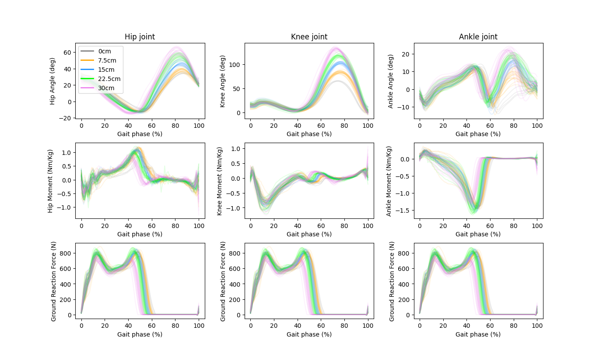
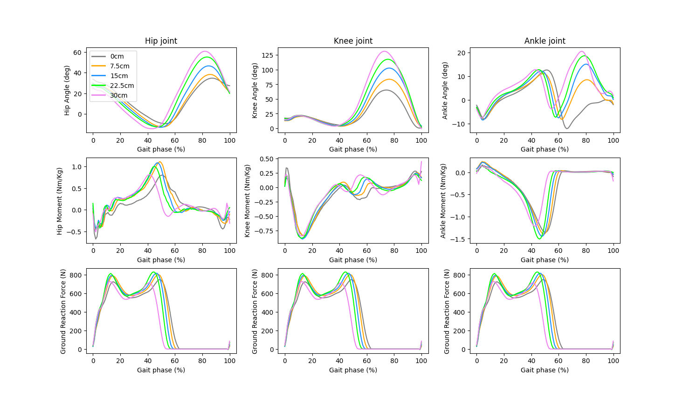

# CROSS_OBSTACLE_DATASET
***
## INTRODUCTION
Understanding what changes people make in order to **cross obstacles of different heights** is useful for designing wearable robots such as prosthetics and exoskeletons. However, previous studies have not systematically analyzed the changes in biomechanics as people cross obstacles of different heights. This dataset collected biomechanical data from 10 subjects *(6 men and 4 women, with an average age of around 20 years)* while crossing obstacles of different heights.
***
## HOW TO USE
1. Download the dataset in [Datasets](Datasets "Datasets") 
2. Download the code to extract data in [scripts](scripts "scripts") 
3. Changing the pathfile ``path = "D:\\lab\\experiment\\data\\AB01" `` in order to get all biomechanics data of any subject and draw the graph 
    **ATTENTION**  Only one subject's data can be processed at a time
### EXAMPLE
 

