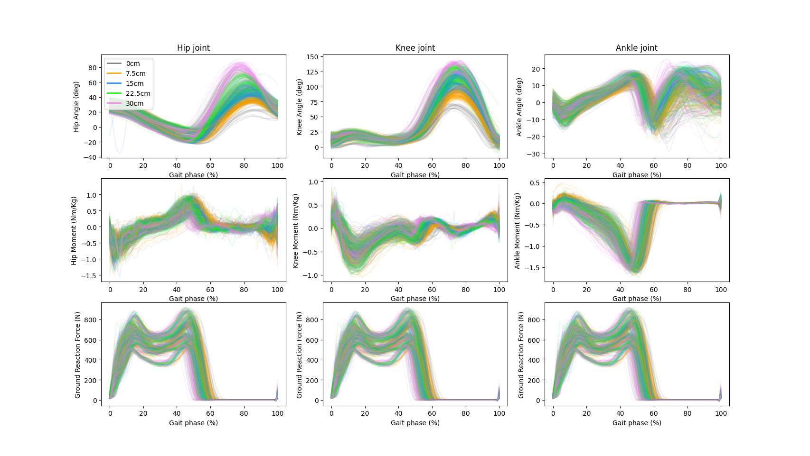
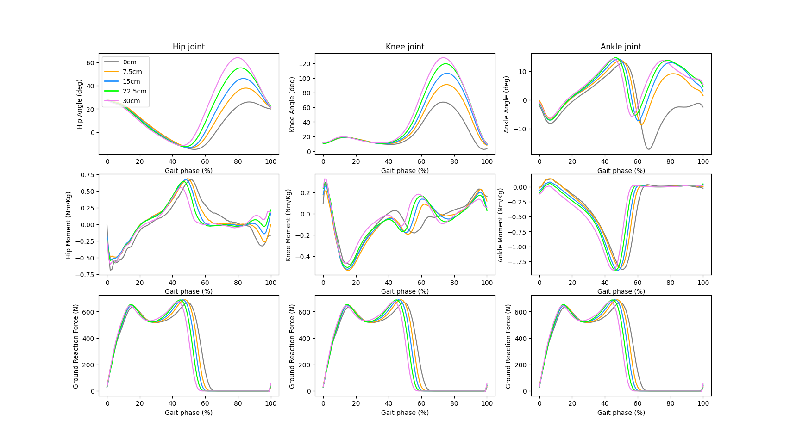

# CROSS_OBSTACLE_DATASET
***
## INTRODUCTION
Understanding what changes people make in order to **cross obstacles of different heights** is useful for designing wearable robots such as prosthetics and exoskeletons. However, previous studies have not systematically analyzed the changes in biomechanics as people cross obstacles of different heights.We used the motion capture system to collect the data, and used the ***Helen Hayes model*** to process the raw data to get hip, knee and ankle angles, torque data, and ground reaction. This dataset collected biomechanical data from 10 subjects *(6 men and 4 women, with an average age of around 20 years)* while crossing obstacles of different heights.
***
## HOW TO USE
### Draw single subject
This script can help you draw the data of a subject crossing an obstacle, you can choose any subject and height
1. Download the dataset in [Datasets](Datasets "Datasets") 
2. Download the code to extract data in [Draw_one](scripts/Draw_one.py "Draw_one") 
3. Changing the pathfile ``path = "D:\\lab\\Cross_obstacle_data_sets\\CROSS_OBSTACLE_DATASET\\Datasets\\AB07" `` in order to get all biomechanics data of any subject and draw the graph 
4. Choose the height you need in``Height = ['h0', 'h75', 'h150', 'h225', 'h300']`` 
    **ATTENTION**  Only one subject's data can be processed at a time
#### EXAMPLE
 
 
### Draw multiple subjects
This script can help you draw the data of multiple subjects that you need crossing an obstacle, you can choose any subject
1. Download the code to extract data in [Draw_mult](scripts/Draw_mult.py "Draw_mult") 
2. Changing the pathfile ``path = "D:\\lab\\Cross_obstacle_data_sets\\CROSS_OBSTACLE_DATASET\\Datasets\\AB07" `` in order to get all biomechanics data of any subject and draw the graph 
3. Choose the subjects you need in``subjects = ['AB01', 'AB02', 'AB03', 'AB04', 'AB05', 'AB06', 'AB07', 'AB08', 'AB09', 'AB10'] `` 
#### EXAMPLE
 
 
### ADDITION
If you just want to extract the data of the individual joints without drawing a graph, you can delete the drawing code and just use part of the code like ``force = pd.read_excel(file_path, sheet_name='force')``
***
## Usage
This dataset can be used for research in multiple fields, including but not limited to exoskeletons, powered thigh prosthetics, and medical research.
